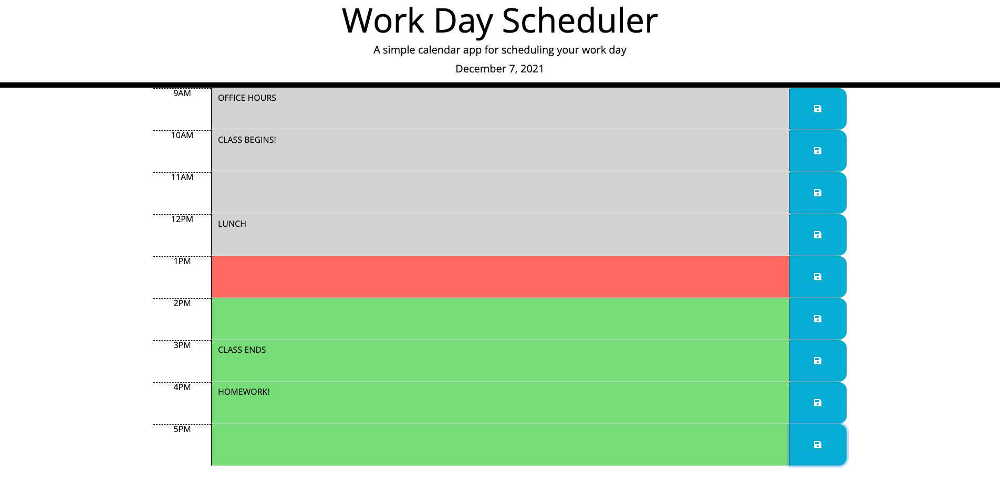

# **Day Planner**
***

## Table of Contents
1. [Description](#description)  
2. [Links](#links)  
3. [Visuals](#visuals)  
***

## Description
**Day Planner** is a simple calendar application that allows a user to save events for each hour of the day. This app runs in the browser and features dynamically updated HTML and CSS powered by jQuery.

When the planner is opened the current day is displayed at the top of the calendar. If the user scrolls down they are presented with timeblocks for standard business hours (9am-5pm) When viewing the timeblocks for that day, each timeblock is color coded to indicate whether it is in the past (gray), present (red), or future (green). When they click into a timeblock they can enter an event. Afterwards they can click the save button dedicated to that timeblock. The text for that event is saved in local storage and when the page is refreshed the saved events are still seen. 

***

## Links
[Link to Day Planner](https://mattholtmoore.github.io/day-planner-project/)

[Link to GitHub.com](https://github.com/mattholtmoore/day-planner-project)  
***

## Visuals

 